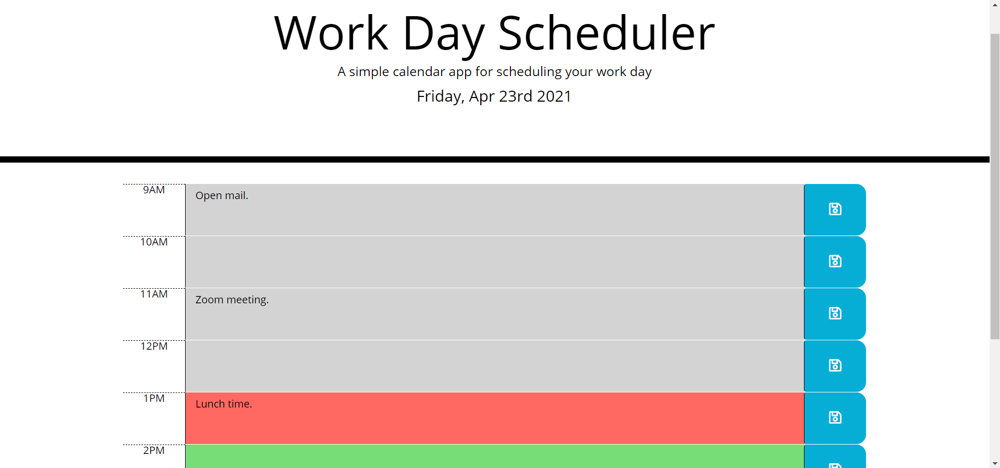
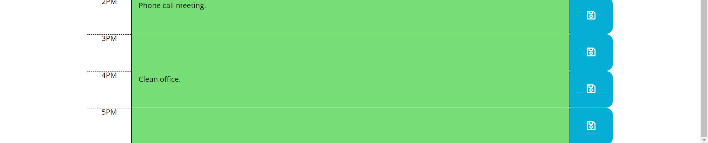

# workscheduler

## **Project Summary** ⚡️

_As an employee with a busy schedule, I want to add important events to a daily planner so  can manage my time effectively._

__________________________________________________________________________________________________________________________________________________

## **Tools Used** 🛠️

* HTML
* CSS
* Javascript
* Powered by jQuery

___________________________________________________________________________________________________________________________________________________

## **Project Goals** 📚

* When the planner is opened, the current day is displayed at the top of the calender.
* The planner timeblock is standard business hours.
* Each timeblock is color coded to indicate whether it is in the past, present or future.
* When timeblock is selected and event is entered, saved button is clicked then the text for that event is save in local storage.
* When paged is refreshed, the saved events persist.

___________________________________________________________________________________________________________________________________________________

## **Website** 📷

*Screenshots of prompts.*

___________________________________________________________________________________________________________________________________________________

## **Recourses** 💡
[ Javascrpit: W3sschools](https://www.w3schools.com/)

[My Github: Live website](https://katherineyoguez.github.io/workscheduler/)

___________________________________________________________________________________________________________________________________________________

### _Contact_ 📇

Email: Katherinecarlotayoguez@gmail.com